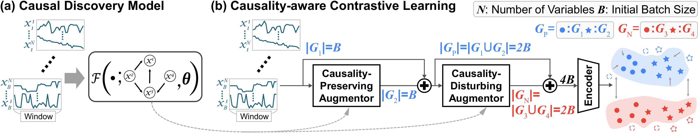
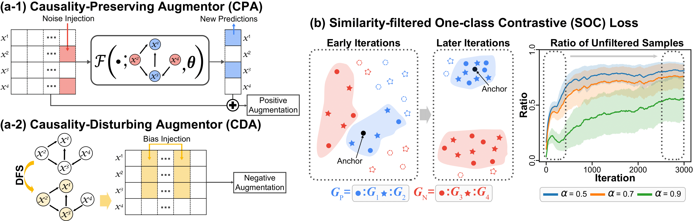

# [ICML 2025] Causality-Aware Contrastive Learning for Robust Multivariate Time-Series Anomaly Detection

## Overview
The figures below illustrate the overview pipeline and components of the CAROTS framework. 
For more detailed information, please refer to our paper.

  

  


---

## Dataset Preparation

### Download Links
- [SWaT](https://itrust.sutd.edu.sg/itrust-labs_datasets/dataset_info/)
- [WADI](https://itrust.sutd.edu.sg/itrust-labs_datasets/dataset_info/)
- [PSM](https://github.com/eBay/RANSynCoders/tree/main)
- [SMD](https://github.com/NetManAIOps/OmniAnomaly/tree/master)
- [SMAP](https://github.com/khundman/telemanom)


For the `SMD` and `SMAP` datasets, preprocessing was performed based on the script available at [OmniAnomaly's data_preprocess.py](https://github.com/NetManAIOps/OmniAnomaly/blob/master/data_preprocess.py). After preprocessing, the datasets were placed in the following directories:

```
data/
├── ServerMachineDataset/  # Preprocessed SMD dataset
└── SMAP_MSL/              # Preprocessed SMAP dataset
```

### Synthetic Dataset Generation
To generate synthetic datasets (Lorenz96 and VAR), use the following commands:

```bash
cd data/Lorenz96
python generate.py
```

```bash
cd data/VAR
python generate.py
```

### Dataset Organization
Place the downloaded datasets in the `data/` directory, ensuring each dataset resides in its respective subdirectory:

```
data/
├── Lorenz96/
├── VAR/
├── SWaT/
├── WADI/
├── PSM/
├── ServerMachineDataset/
└── SMAP_MSL/
```

---

## Example Execution

Scripts for running the model are located in the `scripts/` directory. Use the following command to execute the model:

```bash
bash scripts/{dataset}.sh
```

**Example:** To run the model on the `SWaT` dataset:

```bash
bash scripts/SWaT.sh
```

---

The results of the model execution are saved in the `results/{dataset}` directory. 

## Citation

If you find our work useful, please cite our paper:

```bibtex
@article{kim2025causality,
  title={Causality-Aware Contrastive Learning for Robust Multivariate Time-Series Anomaly Detection},
  author={Kim, HyunGi and Mok, Jisoo and Lee, Dongjun and Lew, Jaihyun and Kim, Sungjae and Yoon, Sungroh},
  journal={arXiv preprint arXiv:2506.03964},
  year={2025}
}
```

---

## License

This project is licensed under the MIT License. For commercial use, permission is required.

---

## Acknowledgements

Please provide proper attribution if you use our codebase.  
If you use our work, kindly cite our paper as mentioned in the Citation section.